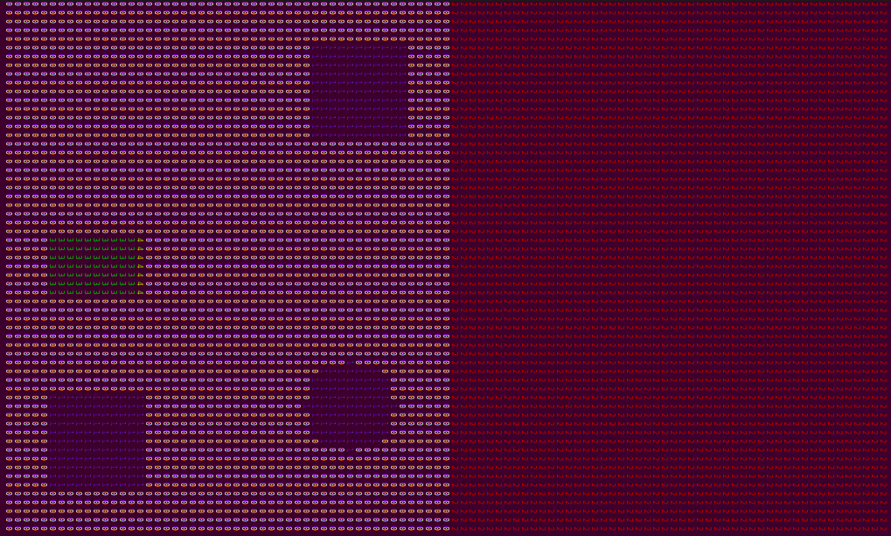
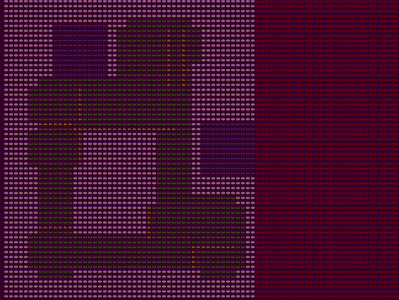

# Lego Robot EV3

This project has been developed in the Operating System course at EURECOM by the **LegoOfLegends TEAM**, composed of:
 - Andrea TRUFINI (LINKEDIN: https://www.linkedin.com/in/andrea-trufini-15471899/)
 - Matteo GUARRERA (LINKEDIN: https://www.linkedin.com/in/matteoguarrera/)
 - Riccardo TORRES
 
 Website dedicated to the robot: http://www.andreatrufini.altervista.org/

## Did by Andrea Trufini
  The LegoOfLegends robot has been developed in different steps.
  I have worked on different aspects:
  <ol>
    <li> all the movements of the robot;</li>
    <li> a simulator to test the navigation algorithm; </li>
    <li> the navigation of the robot; </li>
    <li> developed this website. </li>
  </ol>

  
During the development I faced different OS concepts like:

      <ul>
        <li>Threads</li>
        <li>Synchronization of threads using semaphores</li>
        <li>Real-time scheduling</li>
        <li>Producer-Consumer problem</li>
      </ul>
     
      In the following there is a summary of what I did. Since all the functions are commented in the code
      I explain here just the main structure.
       

<h2>1. Movements of robot</h2>
      I developed all the functions used by the robot to move. Some movements have been implemented with the use of the gyroscope.
      The functions which deal with movements are in the files:
        <ul>
          <li> motors.c - motors.h -> Basical movements of the motors </li>
          <li> navigation.c - navigation.h -> All the functions use by the robot to move: like rotate right/left or move straight/back</li>
          <li> sensors.c - sensors.h -> Basical use of the sensors </li>
        </ul>

   <h2>2. Simulator </h2>
      In order to develop the algorithm to have autonomous navigation of the robot I developed a simulator.
      I developed the files:
        <ul>
          <li> draw.c - draw.h -> Functions used to draw map, objects and the robot </li>
          <li> matrix_movements.c - matrix_movements.h -> All the functions to simulate the movements of the matrix(robot) in the map</li>
          <li> matrix_navigation.c - matrix_navigation.h -> Algorithm used for the autonomous driving of the robot</li>
        </ul>

   The simulator uses a terminal graphical output to allow to the developer to see all the movements
      done step by step by the virtual robot.  
      Functions to simulate objects in the map have been implemented. The next picture is an example of the
      output provided by the simulator.  

   
      It is possible to run the simulation in order to see the single movements of the robot in the map
      or there is the possibility to run a simulation which shows the part of the field covered by the
      robot, as shown in the following picture (the green part indicate the area covered by the robot).
       

 

 <h2>3. Navigation of the robot</h2>
        After the simulator has been done, and when the real mapping algorithm was ready, I merged the
        real movements of the robot with the simulator. In the final version there is the possibility to
        see the real movements, done by the robot, with a real-time print of the map on the terminal.
          
        I also implemented the function to find the objects position.
          
        The main files modified to obtain the real navigation of the robot are:
          <ul>
            <li> matrix_navigation.c - matrix_navigation.h </li>
          </ul>

<h2>4. Web site</h2>
      I built all the website without using templates or frameworks. I hope you will like the design :)  
